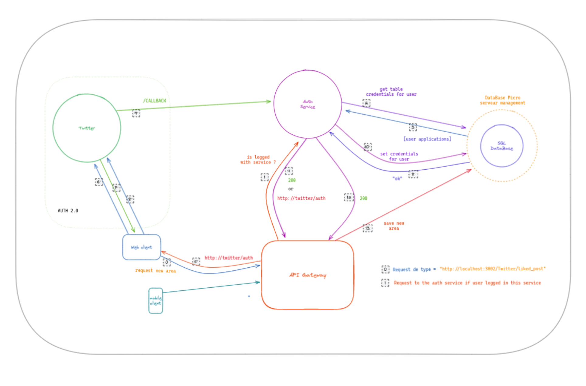

# AREA - Action Reaction project (IFTT like)

web-app to automate common web action and link them to a chosen reaction

## Running the project

This wep-app is dockerized so to run this project simply run the command:
```
docker compose up -d --build
```

## Services

- <a href="./backend/services/coingecko/README.md">Coingecko<a/>
- <a href="./backend/services/discord/README.md">Discord<a/>
- <a href="./backend/services/github/README.md">Github<a/>
- <a href="./backend/services/google/README.md">Google<a/>
    - Calendar
    - Drive
    - Gmail
    - Youtube
- <a href="./backend/services/ipfs/README.md">IPFS<a/>
- <a href="./backend/services/linkedin/README.md">Linkedin<a/>
- <a href="./backend/services/spotify/README.md">Spotify<a/>
- <a href="./backend/services/twitch/README.md">Twitch<a/>
- <a href="./backend/services/twitter/README.md">Twitter<a/>
- <a href="./backend/services/weather/README.md">Weather<a/>


## Architecture



## Technologies

### Languages:


### Backend:
- Gateway
- Micro-services
- PgSQL

### Frontend:
- ReactJS
- Flutter IOS ans Android

### DevOps CI/CD
- Docker
- Github Actions

## 🤝 Contributors
- <a href="./backend/services/coingecko/README.md">Antoine GAVIRA-BOTTARI<a/>
- <a href="https://github.com/valoup917">Valentin FOUILLET<a/>
- <a href="https://github.com/twillsonepitech">Thomas WILLSON<a/>
- <a href="https://github.com/Zesor">Illyas CHIHI<a/>
- <a href="https://github.com/silyanait">Silya NAIT ZERRAD<a/>

* Score: <span style="color:rgb(0, 255,0)">&#9724; 100% </span>